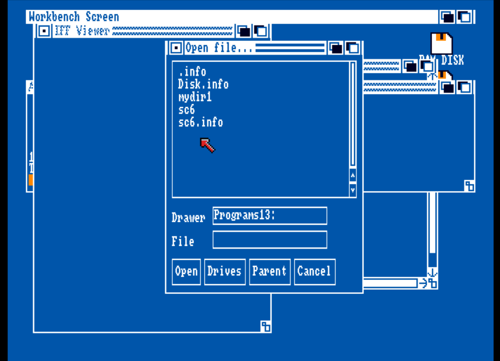

# SOFIA Gadgets Library (Simple Old Fashioned Intuition for Amiga)

## Description

This is a small gadget library for Amiga OS systems, versions 1.3 and up.
The library was written out of the desire to write programs that can run
on older systems that were never upgraded to 2.x or 3.x.
Thanks to the design of the Amiga's operating system, well behaving applications
that were written for 1.x systems can still run fine on newer systems and
can even scale their features depending on the operating system version.

This library was based on the example library code in the Amiga RKM

## Feature set

Currently this library contains only a single functionality, a file requester.
Unfortunately, standard requesters only appeared in OS versions 2.x and up,
so it makes sense to support this first.

## Acknowledgements

Special thanks to Frank Wille (phx) for all his support and advice to
understand the details of the VBCC/VLINK/VASM toolchain which was
instrumental in getting this library working under Amiga OS 1.3
